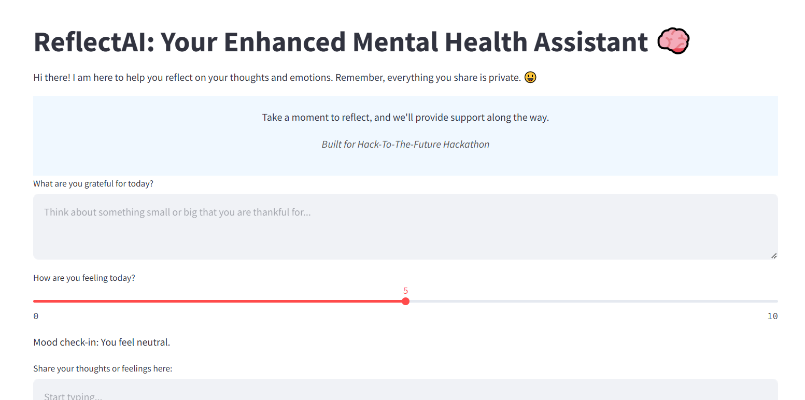
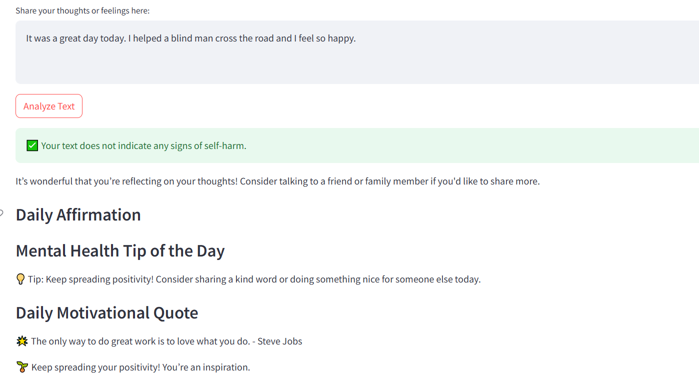

# ReflectAI: Mental Health Support Chatbot

ReflectAI is an interactive chatbot designed to help users reflect on their thoughts and emotions, offering personalized emotional analysis and helpful mental health resources.

## Jump to [Deployment](./README.md#how-to-run)

## Problem

Mental health is often overlooked, and people may not always have a safe space to express their feelings. In moments of distress, having a simple way to reflect can make a difference. Many existing solutions focus on just one aspect, like providing resources, but do not personalize the experience or offer immediate support tailored to individual emotional states.amlit.app

## Solution

ReflectAI combines emotion analysis with personalized journaling prompts, mood tracking, and a daily affirmation system to help users stay grounded. The app leverages machine learning to analyze text for signs of distress, offering support in real-time and connecting users with helpful resources when necessary.



## Features

- **Mood Check-In**: Allows users to rate how they’re feeling, offering personalized affirmations based on their mood.
- **Prediction Model**: Classifies user text into categories (like signs of self-harm) and suggests resources if necessary.
- **Journal Prompts**: Encourages daily reflection with suggestions for positive thinking and emotional expression.
- **Helpful Resources**: Provides users with links to mental health resources, such as meditation guides and breathing exercises.
- **Interactive Feedback**: Users can rate the accuracy of the emotional analysis, helping improve the system over time.

## Tech Stack

- **Frontend**: Streamlit for a simple and clean interface.
- **Backend**: Python for model integration and text processing.
- **Machine Learning**: A pre-trained model for emotion classification and sentiment analysis using custom preprocessing.
- **Libraries**: NLTK, Pandas, and others for NLP and data handling.

## How to Run

1. Clone the repository:
   ```bash
   git clone https://github.com/Vai-Man/ReflectiveAI.git
   cd reflectai
   ```

2. Install dependencies:
   ```bash
   pip install -r requirements.txt
   ```

3. Run the app:
   ```bash
   streamlit run app.py
   ```

4. Open the app in your browser (default URL: http://localhost:8501).

